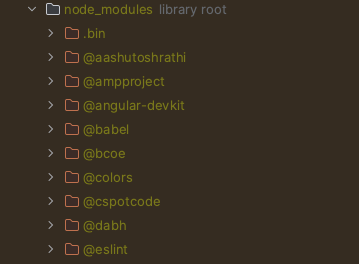
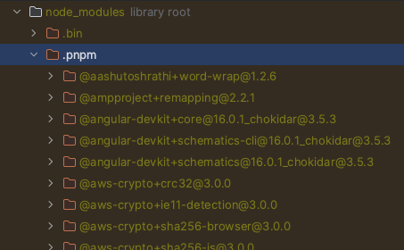
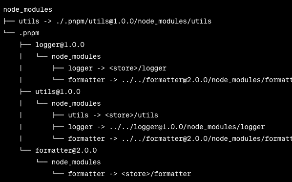

## NPM & Yarn의 불편함

- 상위 디렉토리의 `node_modules` 폴더를 탐색해서 해당 패키지를 검색합니다.
    - 느린 I/O 호출 반복 또는 중간에 실패하는 경우도 있습니다.
- `node_modules` 에 패키지들을 설치하고 디펜던시-하위디펜던시의 관계를 트리형인 Hoisting 구조로 관리합니다.
    - Hosting : 의존성 트리에서 참조하는 하위 패키지가 중복되는 경우 끌어올리는 방식입니다. 직접 의존하지 않는 패키지가 끌어올려지면서 참조가 가능한 일이 발생하게 됩니다(유령 의존성).
- yarn berry(PnP)의 부하
    - .yarn/cache 위치에 패키지에 대한 데이터를 압축시켜서 github repository에 저장하는데 깃헙 작업량이 많을수록 Github에 부하가 갈 수 있습니다.
    - 이 부하를 해결하기 위한 작업도 추가적으로 필요할 수 있습니다.
- Yarn Workspace에서 특정앱에만 패키지를 설치하는 번거로움
- 그외 블로그 참조
    - https://toss.tech/article/node-modules-and-yarn-berry
    - https://engineering.ab180.co/stories/yarn-to-pnpm

## PNPM의 장점

- 최상단 경로에 있는 패키지들 범위에서 참조하는 패키지들을 `node_modules/.pnpm` 폴더에 정리합니다.




- symlink 구조방식 (https://pnpm.io/ko/symlinked-node-modules-structure)
    - `foo`에서 `bar, qar`이 직접 참조되기 때문에 심볼릭 링크`foo -> ./.pnpm/foo@1.0.0/node_modules/foo` 로 가능함
    


    
    
### 심볼릭 링크를 생성하는 결졍 요소
>하위 내용은 공식문서를 읽고 ChatGPT 3.5에 질문을 해서 얻은 답을 약간 수정했습니다.

1. 직접적인 의존성
패키지가 직접적으로 프로젝트의 코드에서 참조되는 경우, 패키지 매니저는 해당 패키지를 심볼릭 링크로 참조할 수 있습니다. 

-> 위에 예시에서 utils가 직접 참조인 logger, fomatter를 참조하는게 아닌 하위 패키지를 참조한다면 심볼릭 링크로 생성 될 수 없습니다.


2. 중복 최소화
이미 설치된 패키지를 다른 패키지에서도 필요로 할 때 해당 패키지를 .pnpm 폴더의 심볼릭 링크로 참조 가능합니다.


3. 버전 충돌 해결
만약 여러 패키지가 서로 다른 버전의 같은 패키지를 의존하고 있다면, 패키지 매니저는 중복을 피하기 위해 각각의 패키지에 대해 적절한 버전을 .pnpm 하위에 설치하고 관리합니다.


---
# Monorepo란

- Monolithic Repositories로 하나의 레파지토리에서 여러개의 프로젝트를 관리하는 구조입니다.
- `libs` 라는 폴더를 만들어 해당 폴더에서는 각 애플리케이션이 공통으로 사용하는 DB와 같은 인프라 세팅이나 간단한 utils 함수, 추상화를 위한 부모클래스 등이 존재할 수 있습니다.

## NestJS Workspaces에 대하여

→ Monorepo mode로 구축하며 모듈이 application / library 역할로 나뉘어집니다.
nest-cli.json 파일에 monorepo로 설계된 프로젝트들에 대한 메타데이터가 기록됩니다.

[NestJS 공식문서(Workspaces)](https://docs.nestjs.com/cli/monorepo)


---
## 프로젝트 구축방법


### 0. pnpm 설치

```bash
npm install -g pnpm
```

### 1. 기본 생성

```bash
$ nest new 프로젝트명
	- pnpm (패키지 매니저 선택)
```

- pnpm-lock.yaml 파일 생성


### 2. 애플리케이션 폴더 생성


- apps 폴더 하위에 애플리케이션 폴더 생성 (각 서버로 배포될 앱)

→ apps 폴더안에 설정한 앱이름의 폴더가 생성됩니다

```bash
$ nest g app 앱이름
```

### 3. 라이브러리 폴더 생성

- 재사용을 위한 공통 라이브러리 폴더 생성
- [package.json, tsconfig.json, nest-cli.json] 업데이트

→ libs 폴더안에 설정한 라이브러리 폴더가 생성됩니다

```bash
$ nest g lib core
```

#### libs 내 폴더 소개
-> [NestJS 모노레포 템플릿](https://github.com/mikemajesty/nestjs-monorepo)을 참고하여 설명합니다

- `├── libs ├── core`: 핵심 비즈니스가 담긴 모듈로 타 애플리케이션에서 공유할 클래스 등을
- `├── libs ├── modules`: http, databse 같은 인프라 관리 모듈
- `├── libs ├── utils`: 유틸리티 관련 모듈

### 4. 기타 설정파일 세팅
- pnpm-workspace.yaml

→ **pnpm으로 직접 모노레포 구축시에는 package 인식을 위해 필요하지만 nestjs의 workspaces 방식을 사용한다면 불필요합니다.**

- 최상위 디렉토리 경로에 생성합니다.
- 하나의 패키지 단위들의 경로를 설정합니다.

```yaml
packages:
  - apps/*
  - libs/*
```

---

## 프로젝트 사용법 (pnpm CLI)

### 1. 필요한 패키지 설치

```bash
$ pnpm install
$ pnpm add  패키지
```

### 2. 앱 빌드 및 실행

- `app` 은 apps 폴더안에 있는 폴더명을 입력

```bash
$ pnpm build app
$ pnpm start app
```

### 3. 의존성 관리

```bash
$ pnpm add <package> # dependencies
$ pnpm add -D <package> # devDependencies
$ pnpm add -g <package> # global
```


## 마무리
NestJS 경우에는 기본적으로 모노레포 구축을 위한 공식지원이 있어서 만드는데에 큰 어려움은 없었다. 회사에서 Yarn Berry로도 전에 만들어서 써본적이 있었는데 cache 폴더 관리도 번거롭고 앱별로 패키지 설치하는게 번거로웠어서 PNPM을 시도해보게 되었다.
내용도 쉽고 패키지 관리도 여러모로 장점이 많은 것 같아서 PNPM&NestJS 모노레포 조합은 앞으로도 쓸 것 같아 추후 다시보기 위해 정리했습니다...