```mermaid
flowchart LR
    SubGraph1[AWS Cloud] --> CloudWatch[CloudWatch Alarm]
    CloudWatch -- "1. Alarm State Trigger" --> SNS[Amazon SNS Topic]
    SNS -- "2. HTTPS Webhook" --> DD_Integration[Datadog SNS Integration]
    DD_Integration -- "3. Event Ingestion" --> DD_Events[Datadog Events]
    DD_Events -- "4. Page On-Call Team" --> OnCall[Datadog On-Call Team]
```

AWS 인프라를 모니터링하기 위해 Datadog의 AWS Integration을 활용할 때, 많은 엔지니어들이 겪는 대표적인 한계 중 하나는 **메트릭 수집 지연(Metric Delay)**입니다.

Datadog이 AWS CloudWatch API를 통해 주기적으로 메트릭을 스크래핑(Polling)해 오는 구조 특성상, 기본 수집 주기에는 **약 10분 정도의 지연(10-minute crawl delay)**이 발생합니다. 일반적인 추이 분석이나 대시보드 관찰에는 문제가 없지만, 장애 발생 시 **즉각적인 대처와 온콜(On-Call) 대응이 필요한 미션 크리티컬 상황에서는 10분의 알림 지연이 서비스 SLA/SLO 파괴로 직결**될 수 있습니다.

본 포스팅에서는 이러한 메트릭 수집 지연을 극복하기 위해 **AWS CloudWatch Alarm ➔ SNS Topic ➔ Datadog Webhook ➔ Datadog On-Call Team**으로 이어지는 실시간 알림 파이프라인 구축 배경과 과정, 그리고 결과 및 참조 문서를 정리합니다.

---

## 도입 배경: 왜 CloudWatch Alarm + SNS 조합이 필요한가?

Datadog 공식 문서에 따르면, CloudWatch API의 호출 비용 및 쿼리 제한(Throttling)을 방지하기 위해 Datadog의 기본 메트릭 스크래핑은 10분 단위로 일괄 실행됩니다.

```text
[AWS CloudWatch API] ─── (10분 주기 Crawling) ───► [Datadog Metrics Engine] ───► [Datadog Monitor Alert]
                                                  ▲
                                                  └── 최대 10분의 수집 지연 발생!
```

이 지연을 줄이는 방법으로 **CloudWatch Metric Streams(via Kinesis Data Firehose)**를 도입할 수도 있지만, 모든 메트릭 스트리밍에 따른 추가 비용과 파이프라인 관리 공수가 수반됩니다.

대신 **중요 장애 알림(Alarm)에 한해서 실시간성**을 확보하려면, AWS 내부에서 상태 변경 시 즉시 발송되는 **CloudWatch Alarm ➔ SNS Event Webhook** 구성을 활용하는 것이 가장 효율적이고 비용 가성비가 뛰어납니다.

---

## 전체 아키텍처 및 데이터 흐름

구축할 파이프라인의 전체 데이터 흐름은 다음과 같습니다.

```text
[AWS Resources]
  └─ (EC2 / RDS / Lambda / EKS 등)
        │
        ▼
[CloudWatch Alarm] ── (State = ALARM) ──► [Amazon SNS Topic]
                                                 │
                                                 ▼ (HTTPS Webhook)
                                     [Datadog SNS Integration]
                                                 │
                                                 ▼ (Event Ingestion)
                                    [Datadog Events / Monitors]
                                                 │
                                                 ▼ (@oncall-team-name)
                                     [Datadog On-Call Team]
                                       (Pager / App / Slack)
```



---

## 단계별 구축 과정

### Step 1. AWS SNS Topic 생성 및 Datadog Webhook Subscriptions 설정

1. **AWS SNS Topic 생성**
   - AWS Console ➔ Amazon SNS ➔ Topics ➔ **Create topic** 선택
   - Type: `Standard`
   - Name: `cloudwatch-alarms-to-datadog` 입력 후 생성

2. **Datadog Webhook Endpoint URL 준비 및 Subscription 추가**
   - Datadog SNS Integration에서 제공하는 Webhook Endpoint URL을 확인합니다.
   - SNS Topic의 Subscriptions 탭에서 **Create subscription**을 클릭합니다.
     - **Protocol**: `HTTPS`
     - **Endpoint**: Datadog SNS Integration Webhook URL (예: `https://api.datadoghq.com/intake/v1/input/<DATADOG_API_KEY>?app_key=<DATADOG_APP_KEY>` 또는 Integration 전용 Webhook Endpoint)
   - **Subscription Confirmation (자동 승인)**
     - Datadog SNS Integration은 SNS에서 전송하는 `SubscriptionConfirmation` 메세지를 자동으로 인식하고 수신 승인을 완료합니다.
     - 설정 후 SNS Console에서 Subscription 상태가 `Confirmed`로 변경되었는지 확인합니다.

---

### Step 2. Datadog AWS SNS Integration 활성화

1. Datadog Console ➔ **Integrations** ➔ **Amazon SNS** 검색 후 활성화
2. 수신된 SNS 메시지가 Datadog의 **Events Stream**에 정상적으로 맵핑되도록 설정합니다.
3. SNS 메시지 Payload에 포함된 CloudWatch Alarm 정보(AlarmName, NewStateValue, Reason 등)가 Datadog Event 태그 및 본문으로 파싱되는지 확인합니다.

---

### Step 3. AWS CloudWatch Alarm 구성 및 SNS Topic 연동

1. **CloudWatch Alarm 생성**
   - AWS Console ➔ CloudWatch ➔ Alarms ➔ **Create Alarm** 선택
   - 대상 메트릭 선택 (예: RDS `CPUUtilization` > 80%, EC2 `StatusCheckFailed` >= 1 등)
2. **Notification Action 설정**
   - **Alarm state trigger**: `In alarm` 선택
   - **Send notification to...**: Select an existing SNS topic ➔ `cloudwatch-alarms-to-datadog` 선택
3. Alarm 저장 및 테스트 트리거 진행

```text
CloudWatch Alarm Trigger ➔ SNS Topic Publish ➔ Datadog HTTPS Webhook 호출 (실시간)
```

---

### Step 4. Datadog On-Call 팀 할당 (Page a Datadog On-Call team from SNS)

SNS를 통해 Datadog으로 유입된 이벤트는 Datadog On-Call 서비스와 연동하여 24/7 담당 엔지니어에게 Paging을 보낼 수 있습니다.

1. **Datadog On-Call 팀 및 에스컬레이션 정책 설정**
   - Datadog Console ➔ **On-Call** (또는 Service Management) ➔ Teams ➔ 팀 생성 및 당직 스케줄/에스컬레이션 정책(Escalation Policy) 등록
2. **SNS Event ➔ On-Call Paging 연동**
   - Datadog Monitor 또는 Event Notification 룰에 온콜 팀 핸들러를 지정합니다.
   - 예시 핸들러: `@oncall-team-name` 또는 `@oncall-devops-team`
   - SNS payload에 포함된 태그나 Event 파싱 조건을 기반으로 온콜 전송 매칭 Rule을 작성합니다.
3. **알림 전송 채널**
   - 온콜 팀원으로 지정된 엔지니어에게 Datadog Mobile Push, SMS, Phone Call, Slack 메시지 등으로 즉각적인 Paging이 수신됩니다.

---

## 결과 및 효과

| 구분 | 기존 (Datadog Metric Scraping) | 개선 (CloudWatch Alarm + SNS Webhook) |
| :--- | :--- | :--- |
| **알림 전달 지연** | **약 10분 (10-minute crawl delay)** | **수 초 이내 (Real-time Webhook)** |
| **장애 인지 속도** | 지연으로 인한 초기 대응 늦어짐 | 알림 발생 직후 즉시 온콜 Paging |
| **비용 및 공수** | Metric Streams 전면 도입 시 비용 발생 | 중요 Alarm 위주로 가성비 높은 구성 |
| **운영 효율성** | Datadog 대시보드 관찰 용도 | 24/7 On-Call 파이프라인 완성 |

1. **수집 지연 극복**: 10분의 스크래핑 대기 시간 없이, CloudWatch Alarm 발생 직후 1~5초 이내에 Datadog Event 생성 및 온콜 호출 완료
2. **MTTR(Mean Time To Recovery) 획기적 단축**: 심각한 인프라 장애 발생 시 담당자가 즉시 인지하여 대처 가능
3. **효율적인 아키텍처**: 모든 메트릭을 실시간 스트리밍하지 않고, Critical한 경보 항목만 SNS Webhook으로 처리하여 비용과 시스템 복잡도를 동시에 최소화

---

## 참고 문서 (References)

- [AWS Docs: Notify Users of Alarm Changes via SNS](https://docs.aws.amazon.com/AmazonCloudWatch/latest/monitoring/Notify_Users_Alarm_Changes.html#US_SetupSNS)
- [Datadog Docs: How to reduce CloudWatch metric delay](https://docs.datadoghq.com/integrations/guide/aws-integration-and-cloudwatch-faq/#how-can-i-reduce-the-delay-of-receiving-my-cloudwatch-metrics-to-datadog)
- [Datadog Docs: Receive SNS Messages](https://docs.datadoghq.com/integrations/amazon-sns/#receive-sns-messages)
- [Datadog Docs: Page a Datadog On-Call team from SNS](https://docs.datadoghq.com/integrations/amazon-sns/#page-a-datadog-on-call-team-from-sns)

---

> 💡 *본 문서는 AI 보조를 받아 작성되었습니다.*

